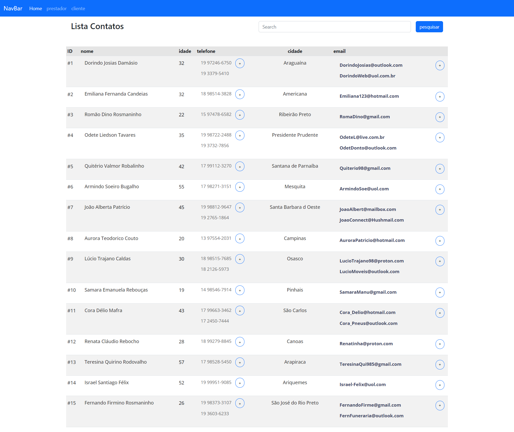

# ProductViewController

## Descrição

projeto realizado na faculdade na disciplina de banco de dados o ProductViewController é uma parte do sistema de gerenciamento de dados. Ele é responsável por exibir, cadastrar, atualizar e excluir informações sobre os produtos armazenados no banco de dados.

## Tecnologias Utilizadas

- HTML
- CSS (Bootstrap)
- JavaScript
- PHP
- MySQL

